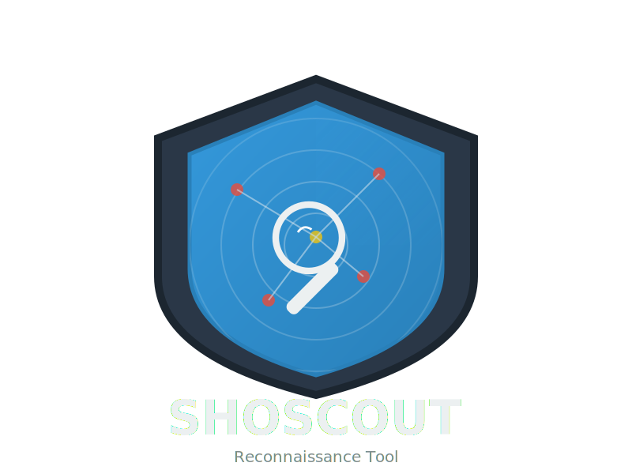
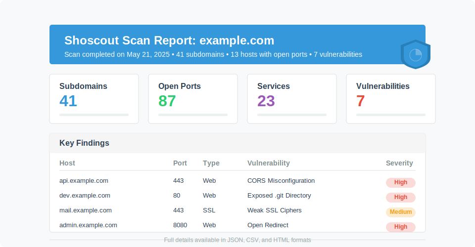

#  Shoscout

<div align="center">
  
  <br><br>
  <strong>An advanced reconnaissance tool for bug bounty hunters and security researchers</strong>
  <br>
  <p>Automate subdomain enumeration, port scanning, service analysis, and vulnerability detection</p>
</div>

<p align="center">
  <a href="#features">Features</a> •
  <a href="#installation">Installation</a> •
  <a href="#usage">Usage</a> •
  <a href="#example-workflow">Examples</a> •
  <a href="#output-structure">Output</a> •
  <a href="#security-and-legal-considerations">Security</a> •
  <a href="#contributing">Contributing</a>
</p>

<hr>

## Features

<div align="center">
  <table>
    <tr>
      <td align="center"><b>🔍</b></td>
      <td><b>Subdomain Enumeration</b></td>
      <td>Discover subdomains using DNS resolution, certificate transparency logs, and Shodan</td>
    </tr>
    <tr>
      <td align="center"><b>📡</b></td>
      <td><b>Port Scanning</b></td>
      <td>Identify open ports and services using Nmap</td>
    </tr>
    <tr>
      <td align="center"><b>🔬</b></td>
      <td><b>Service Analysis</b></td>
      <td>Analyze detected services including web servers, SSL/TLS, SSH, and FTP</td>
    </tr>
    <tr>
      <td align="center"><b>🛡️</b></td>
      <td><b>Vulnerability Checking</b></td>
      <td>Check for common vulnerabilities in web applications and SSL/TLS configurations</td>
    </tr>
    <tr>
      <td align="center"><b>🌐</b></td>
      <td><b>Shodan Integration</b></td>
      <td>Leverage Shodan for additional reconnaissance and vulnerability information</td>
    </tr>
    <tr>
      <td align="center"><b>📊</b></td>
      <td><b>Detailed Reporting</b></td>
      <td>Generate comprehensive reports in multiple formats (JSON, CSV, HTML, TXT)</td>
    </tr>
  </table>
</div>

## Installation

### Prerequisites

- Python 3.7+
- Nmap
- Shodan API key (optional but recommended)

### Setup

1. Clone the repository:
   ```bash
   git clone https://github.com/yourusername/shoscout.git
   cd shoscout
   ```

2. Create a virtual environment and install dependencies:
   ```bash
   python -m venv venv
   source venv/bin/activate  # On Windows: venv\Scripts\activate
   pip install -r requirements.txt
   ```

3. Configure Shodan API key (optional):
   Create a `config/config.yaml` file with your Shodan API key:
   ```yaml
   shodan:
     api_key: "YOUR_SHODAN_API_KEY"
   ```

## Usage

Basic usage:

```bash
python main.py -d example.com
```

Scan multiple domains from a file:

```bash
python main.py -l domains.txt
```

Suppress non-error messages (quiet mode):

```bash
python main.py -d example.com -q
```

Enable verbose output for detailed logs:

```bash
python main.py -d example.com -v
```

Full options:

```
python main.py -h

usage: main.py [-h] [-d DOMAIN] [-l LIST] [-o OUTPUT] [--skip-subdomain] [--skip-port-scan] [--skip-service-check] [--skip-vuln-check] [-v] [-q]

Shoscout - A reconnaissance tool for bug bounty hunters

optional arguments:
  -h, --help            show this help message and exit
  -d DOMAIN, --domain DOMAIN
                        Single domain to scan (e.g., example.com)
  -l LIST, --list LIST  File containing list of domains, one per line
  -o OUTPUT, --output OUTPUT
                        Output directory for results
  --skip-subdomain      Skip subdomain enumeration
  --skip-port-scan      Skip port scanning
  --skip-service-check  Skip service checking
  --skip-vuln-check     Skip vulnerability checking
  -v, --verbose         Enable verbose output (detailed logs)
  -q, --quiet           Suppress non-error messages
```

## Example Workflow

<div align="center">
  
</div>

1. Scan a single domain with all features:
   ```bash
   python main.py -d example.com -o example_scan
   ```

2. Skip certain steps for faster scanning:
   ```bash
   python main.py -d example.com --skip-port-scan --skip-vuln-check
   ```

3. Scan multiple domains from a file:
   ```bash
   python main.py -l targets.txt -o multi_scan
   ```

## Output Structure

Results are organized in the output directory as follows:

```
output/
├── subdomains/
│   ├── subdomains.txt
│   └── ip_mapping.csv
├── ports/
│   ├── open_ports.json
│   └── open_ports.csv
├── services/
│   ├── services.json
│   └── web_services.csv
├── vulnerabilities/
│   ├── vulnerabilities.json
│   └── findings.csv
├── reports/
│   ├── report.html
│   └── summary.txt
└── results.json
```

<div align="center">
  
</div>

## Dependencies

Shoscout relies on the following Python packages:

- dnspython: DNS handling
- python-nmap: Nmap integration
- requests: HTTP requests
- shodan: Shodan API integration
- beautifulsoup4: HTML parsing
- pyyaml: Configuration handling
- tqdm: Progress bars

## Security and Legal Considerations

- Only scan domains that you have permission to test
- Be mindful of the scan intensity and respect rate limits
- Follow responsible disclosure procedures for any vulnerabilities found
- Some techniques may trigger IDS/IPS systems or WAFs

## Contributing

Contributions are welcome! Please feel free to submit a Pull Request.

## License

This project is licensed under the MIT License - see the LICENSE file for details.

<div align="center">
  <br>
  <p>Made with ❤️ for bug bounty hunters and security researchers</p>
  <p>© 2023 Shoscout</p>
</div>